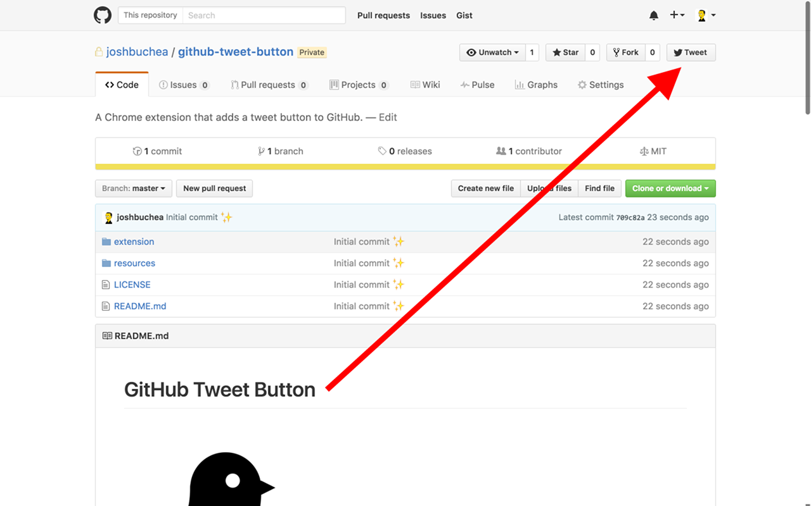

# GitHub Tweet Button

  

---

  

Chrome extension that adds a tweet button to GitHub repo pages.

## Example

The tweet buttons looks like this:

## Install

### Manual Install

* Clone or download this repo
* Browse to `chrome://extensions/`
* Check "Developer mode" if it isn't already checked
* Press "Load unpacked extension..."
* Select the `github-tweet-button/extension` folder
* That's it!

---

## Credits

* [Octopus](https://thenounproject.com/search/?q=octopus&i=901) by [Carol Costa](https://thenounproject.com/carol/) from the Noun Project
* [Bird](https://thenounproject.com/term/bird/233023/) by [Noe Araujo](https://thenounproject.com/noearaujo) from the Noun Project
